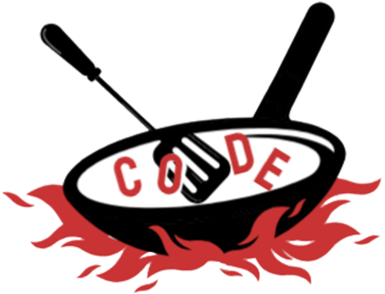

[![Contributors][contributors-shield]][contributors-url]
[![Forks][forks-shield]][forks-url]
[![Stargazers][stars-shield]][stars-url]
[![Issues][issues-shield]][issues-url]

  <a href="https://github.com/AppleBee12/Code_Even">
    
    

  </a>
  

<h1 align=center>"Code Even" Amazing ReadMe!</h1>

안녕하세요 코드이븐에 오신 여러분 환영합니다!

이건 여러분과 함께 만들어가고 완성할 Amazing하고 아주 Fantastic한 ReadMe입니다

<a href="https://www.figma.com/design/VH49EasHjN4QLjkcdUEO9n/CODE_EVEN?node-id=0-1&t=n8MCpj3Oq7MdNSB3-1"><strong>Explore the figma »</strong></a>

## 일정

- [x] 3차 백엔드(관리자페이지, 강사페이지) : 기획 2024.10.09(수) ~ 10.23(수) *2주
- [x] 3차 백엔드(관리자페이지, 강사페이지) : 디자인 2024.10.24(목) ~ 10.30(수) *1주
- [ ] 3차 백엔드(관리자페이지, 강사페이지) : 구현 2024.10.31(목) ~ 11.20(수) *3주
- [ ] 4차 프론트엔드(메인-수강생페이지) : 기획/디자인 2024.11.21(목) ~ 12.04(수) *2주
- [ ] 4차 프론트엔드(메인-수강생페이지) : 구현 2024.12.05(목) ~ 12.18(수) *2주

### Built With

* [![Bootstrap][Bootstrap.com]][Bootstrap-url]
* [![JQuery][JQuery.com]][JQuery-url]

(<a href="#readme-top">back to top</a>)

<!-- MARKDOWN LINKS & IMAGES -->
<!-- https://www.markdownguide.org/basic-syntax/#reference-style-links -->
[contributors-shield]: https://img.shields.io/github/contributors/AppleBee12/Code_Even.svg?style=for-the-badge
[contributors-url]: https://github.com/AppleBee12/Code_Even/graphs/contributors
[forks-shield]: https://img.shields.io/github/forks/AppleBee12/Code_Even.svg?style=for-the-badge
[forks-url]: https://github.comAppleBee12/Code_Even/network/members
[stars-shield]: https://img.shields.io/github/stars/AppleBee12/Code_Even.svg?style=for-the-badge
[stars-url]: https://github.com/AppleBee12/Code_Even/stargazers
[issues-shield]: https://img.shields.io/github/issues/AppleBee12/Code_Even.svg?style=for-the-badge
[issues-url]: https://github.com/AppleBee12/Code_Even/issues
[license-shield]: https://img.shields.io/github/license/AppleBee12/Code_Even.svg?style=for-the-badge
[license-url]: https://github.com/AppleBee12/Code_Even/blob/master/LICENSE.txt
[linkedin-shield]: https://img.shields.io/badge/-LinkedIn-black.svg?style=for-the-badge&logo=linkedin&colorB=555
[linkedin-url]: https://linkedin.com/in/AppleBee12
[product-screenshot]: images/screenshot.png
[Next.js]: https://img.shields.io/badge/next.js-000000?style=for-the-badge&logo=nextdotjs&logoColor=white
[Next-url]: https://nextjs.org/
[React.js]: https://img.shields.io/badge/React-20232A?style=for-the-badge&logo=react&logoColor=61DAFB
[React-url]: https://reactjs.org/
[Vue.js]: https://img.shields.io/badge/Vue.js-35495E?style=for-the-badge&logo=vuedotjs&logoColor=4FC08D
[Vue-url]: https://vuejs.org/
[Angular.io]: https://img.shields.io/badge/Angular-DD0031?style=for-the-badge&logo=angular&logoColor=white
[Angular-url]: https://angular.io/
[Svelte.dev]: https://img.shields.io/badge/Svelte-4A4A55?style=for-the-badge&logo=svelte&logoColor=FF3E00
[Svelte-url]: https://svelte.dev/
[Laravel.com]: https://img.shields.io/badge/Laravel-FF2D20?style=for-the-badge&logo=laravel&logoColor=white
[Laravel-url]: https://laravel.com
[Bootstrap.com]: https://img.shields.io/badge/Bootstrap-563D7C?style=for-the-badge&logo=bootstrap&logoColor=white
[Bootstrap-url]: https://getbootstrap.com
[JQuery.com]: https://img.shields.io/badge/jQuery-0769AD?style=for-the-badge&logo=jquery&logoColor=white
[JQuery-url]: https://jquery.com 

